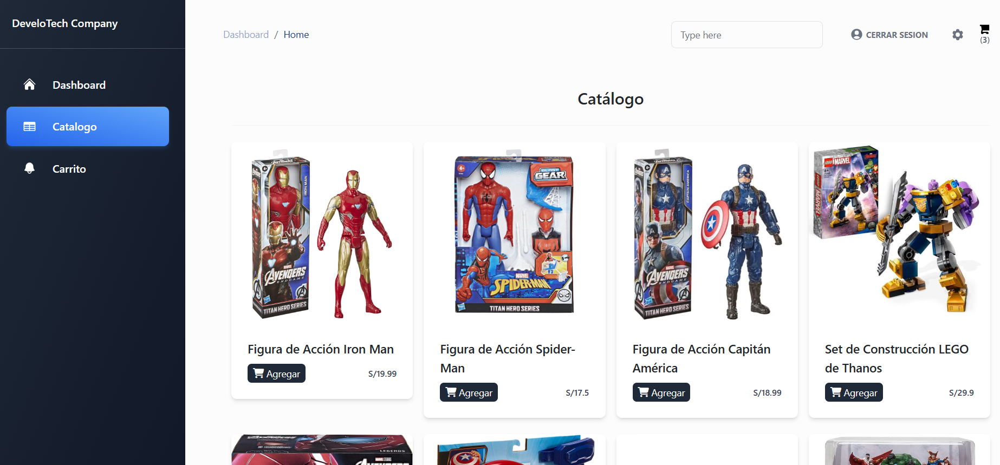

[](https://jose-daniel-g.github.io/AngularAdvengers/)

- [🚀 See demo de Advengers](https://jose-daniel-g.github.io/AngularAdvengers/)
- [🔥  See Project tutorial](https://jose-daniel-g.github.io/frontend-store/inicio)
---

## Screenshots
| LOGIN & REGISTER                                        | SECOND VERSION                                         |
| ---------------------------------------------------- | ------------------------------------------------------ |
|  |  |
|           |            |

| NICE VESION TUTORIAL          |
| ----------------------------- |
|  |


## Cómo Empezar
- versión 18.2.11.  
-
## 📋 Product Management Components

| Component                  | Functionality    | Description                              |
| -------------------------- | ---------------- | ---------------------------------------- |
| **ProductFormComponent**   | `CREATE`, `EDIT` | Formulario para crear y editar productos |
| **ProductListComponent**   | `INDEX` 'list'   | Lista y visualización de productos       |
| **ProductDetailComponent** | `SHOW` 'Detail'  | Muestra los detalles de un producto      |

| Comandos de Generación                 | Tipo      |
| -------------------------------------- | --------- |
| ng g s services/userdata               | Service   |
| ng g c components/user --skip-tests    | Component |
| ng g m app-routing --flat --module=app | Module    |
| ng b   --configuration production      | Build     |

#### Frontend-Store ADD Adminlte
```
npm install admin-lte bootstrap @fortawesome/fontawesome-free
npm install jquery --save
npm install --save-dev @types/jquery
```
###### Deploy Angular en GitHub Pages

1. **Revisar el `angular.json`**  
   - Ir a:  
     ```json
     "projects": { "frontend-store": {
     ```
   - Ese es el **nombre de tu proyecto**.  
   - En la sección `build > options`, agrega (debajo de `outputPath`):  
     ```json
     "baseHref": "/frontend-store/"
     ```
---

2. **Instalar la herramienta de despliegue (si no está instalada)**  
   ```bash
   npm install -g @angular/cli
   ng add angular-cli-ghpages
   ng build --configuration production --base-href "/AngularAdvengers/v2/"
   ng deploy --base-href="/AngularAdvengers/v2/" --dir=v2
   ```
    ```json
    "styles": [
      "node_modules/bootstrap/dist/css/bootstrap.min.css",
      "node_modules/@fortawesome/fontawesome-free/css/all.min.css",
      "node_modules/admin-lte/dist/css/adminlte.min.css",
      "src/styles.css"
    ]
    ```

    ## 📜 Scripts Configuration  

    ```json
    "scripts": [
      "node_modules/jquery/dist/jquery.min.js",
      "node_modules/bootstrap/dist/js/bootstrap.bundle.min.js",
      "node_modules/admin-lte/dist/js/adminlte.min.js"
    ]
    ```

   #### CONFIG ANGULAR.JSON
   - De lo contrario si ya esta en angular.json configurado
   ```bash
   ng build --configuration production 
   ng deploy

   ```
   *Configurar GitHub Pages en GitHub*

   **Ir a tu repo en GitHub → Settings > Pages.**

   - Seleccionar:

   - Branch: gh-pages

   - Folder: / (root)

   - Guardar. 
  ```
  npm i --save-dev @types/bootstrap
  npm install bootstrap jquery jquery-ui-dist slick-carousel line-awesome jquery-nice-select
  ```
### VERSIONS 

```
ng version
npx tsc -v
npm install @ngx-translate/core@latest @ngx-translate/http-loader@latest
ng add @angular/localize

``` 
---
###### Deploy Angular en GitHub Pages

1. **Revisar el `angular.json`**  
   - Ir a:  
     ```json
     "projects": { "frontend-store": {
     ```
   - Ese es el **nombre de tu proyecto**.  
   - En la sección `build > options`, agrega (debajo de `outputPath`):  
     ```json
     "baseHref": "/frontend-store/"
     ```
---

2. **Instalar la herramienta de despliegue (si no está instalada)**  
   ```bash
   npm install -g @angular/cli
   ng add angular-cli-ghpages
   ng build --configuration production --base-href "/frontend-store/"
   ng deploy --base-href=https://jose-daniel-g.github.io/Angular_adminlte/
   ```
   - De lo contrario si ya esta en angular.json configurado
   ```bash
   ng build --configuration production 
   ng deploy

   ```
   *Configurar GitHub Pages en GitHub*

   **Ir a tu repo en GitHub → Settings > Pages.**

   - Seleccionar:

   - Branch: gh-pages

   - Folder: / (root)

   - Guardar.

npm install jquery bootstrap --save